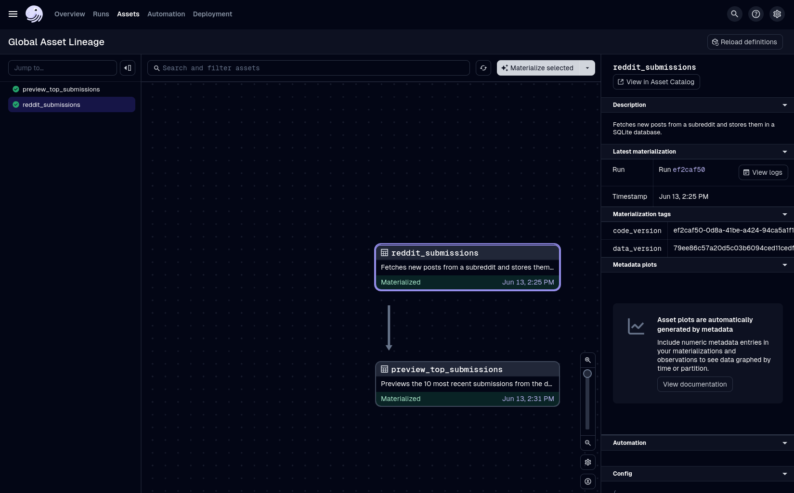

# Dagster Reddit ETL Project

This project uses [Dagster](https://dagster.io/) to create a simple ETL (Extract, Transform, Load) pipeline that fetches new submissions from a specified subreddit using the Reddit API and stores them in a local SQLite database.

## Overview

The pipeline consists of two main assets:
1.  `reddit_submissions`: Extracts data from a subreddit, transforms it, and loads new submissions into a SQLite `submissions` table.
2.  `preview_top_submissions`: A downstream asset that runs after `reddit_submissions` to display a preview of the 10 most recent posts.

The project is designed to be configurable, allowing you to easily change the target subreddit and the number of posts to fetch via a `config.ini` file.

### Asset Graph Preview
Here is a preview of the asset graph in the Dagster UI, showing the dependency between the two assets.



---

## Prerequisites

* Python >=3.9, <3.13
* A Reddit account with API credentials.
* [uv](https://github.com/astral-sh/uv) (a fast Python package installer and resolver).

---

## Setup and Installation

1.  **Clone the Repository**
    Start by cloning the project repository to your local machine.
    ```bash
    git clone https://github.com/rohanvh7/Reddit-Analysis.git
    cd Reddit-Analysis
    ```

2.  **Create a Virtual Environment**
    It's highly recommended to use a virtual environment. `uv` can create one for you.
    ```bash
    uv venv
    source .venv/bin/activate  # On Windows, use `.venv\Scripts\activate`
    ```

3.  **Install Dependencies with `uv`**
    With your virtual environment activated, use `uv sync` to install all required dependencies, including `dagster`, `praw`, and `pandas`, as defined in `pyproject.toml`. To include development dependencies (like `pytest`), use the `--all-extras` flag.
    ```bash
    uv sync --all-extras
    ```

4.  **Configure Environment Variables**
    This project uses a `.env` file to securely manage your Reddit API credentials. Create a file named `.env` in the root directory of the project.

    Copy the following format into your `.env` file and replace the placeholder values with your actual Reddit credentials.

    ```ini
    # .env file
    REDDIT_CLIENT_ID=YOUR_CLIENT_ID_HERE
    REDDIT_CLIENT_SECRET=YOUR_CLIENT_SECRET_HERE
    REDDIT_USERNAME=YOUR_USERNAME_HERE
    REDDIT_PASSWORD=YOUR_PASSWORD_HERE
    REDDIT_USER_AGENT=MyDagsterApp/0.1 by u/YourUsername
    ```
    > **Important**: The `.gitignore` file is already configured to ignore `.env`, ensuring your secrets are not committed to version control. Make sure you don't have double quotes or `<>` around your credentials in the `.env` file.

---

## How to Run the Project

With your virtual environment activated and your `.env` file configured, you can launch the Dagster UI.

1.  **Start the Dagster UI**
    From your project's root directory, run the `dagster dev` command. Dagster will automatically find your code location based on the `[tool.dagster]` section of your `pyproject.toml`.
    ```bash
    dagster dev
    ```

2.  **Access the UI**
    Open your web browser and navigate to [http://localhost:3000](http://localhost:3000).

3.  **Materialize the Assets**
    In the Dagster UI, you will see the asset graph. To run the full pipeline:
    * Select the `preview_top_submissions` asset.
    * Click the **"Materialize"** button. Dagster will automatically run the upstream `reddit_submissions` asset first.

    Upon successful completion, a `submissions.db` file will be created in your project directory, and the run logs for the preview asset will display a table of the latest posts.

---

## Credits
* **AI Assistance**: [Gemini 2.5 Pro](https://deepmind.google/technologies/gemini/)
* **Reddit API Wrapper**: [Praw](https://praw.readthedocs.io)

